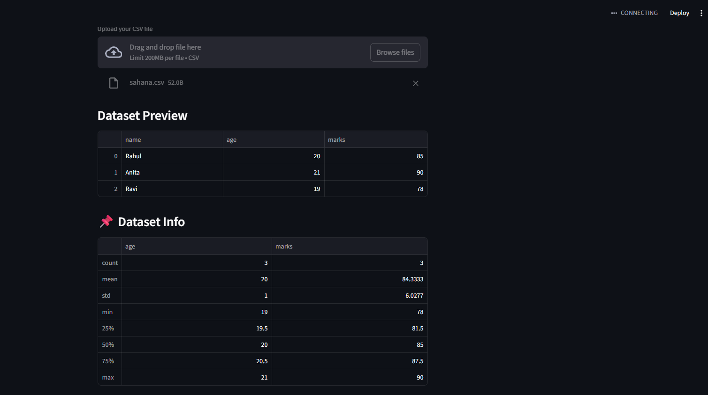
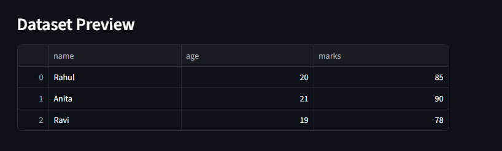
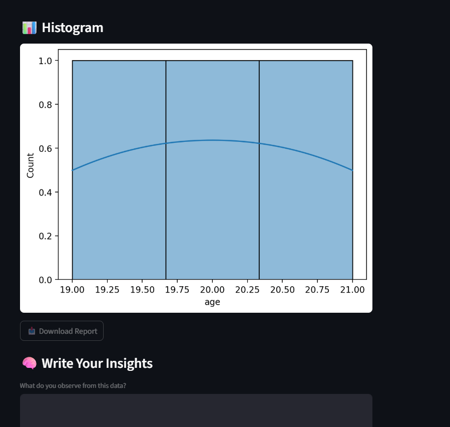
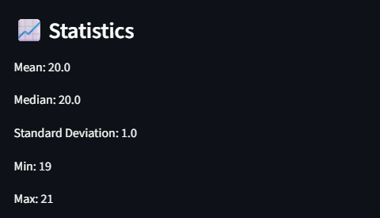

# 📊 Data Explorer App

A simple and interactive Streamlit web application to explore datasets and understand basic statistical concepts.

---

## 🚀 Features

* Upload CSV dataset
* Preview dataset
* Select numeric columns
* View statistics:

  * Mean
  * Median
  * Standard Deviation
  * Minimum & Maximum
* Visualize data using Histogram
* View dataset summary
* Download analysis report
* Write insights about the dataset

---

## 🛠️ Technologies Used

* Python
* Streamlit
* Pandas
* Matplotlib
* Seaborn

---

## 📂 How to Run the Project

1. Clone the repository

2. Install dependencies:
   pip install streamlit pandas matplotlib seaborn

3. Run the app:
   streamlit run app.py

---

## 📸 Screenshots

### 🔹 1. App Interface

### 🔹 2. Dataset Preview

### 🔹 3. Histogram Visualization

### 🔹 4. Statistics

---

## 🧠 Concepts Used

* Mean, Median
* Standard Deviation
* Data Distribution
* Histogram Visualization

---
